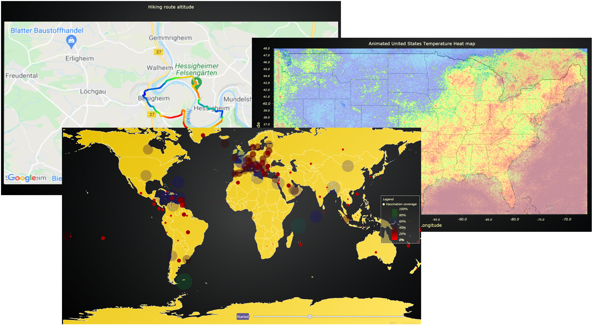
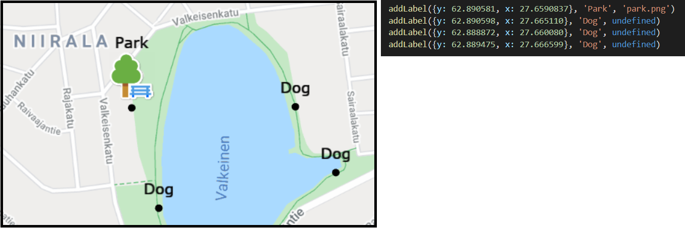
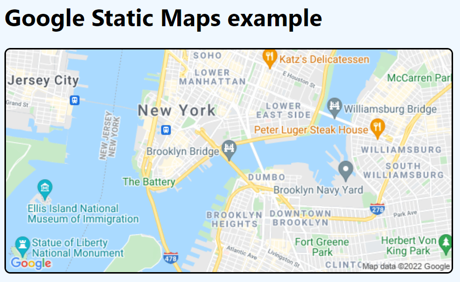
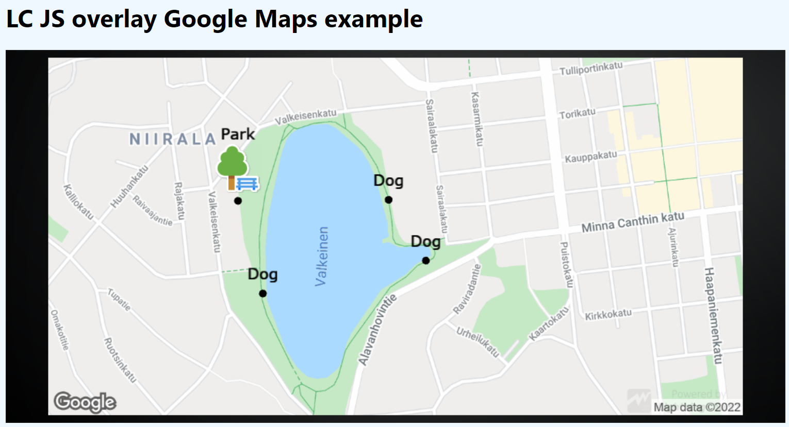

Showcase of [LightningChart JS](https://www.arction.com/lightningchart-js/) use case with Google Static Maps API to implement simplistic geospatial data visualization solutions.

Please see [related brief technical article](https://blog.arction.com/easy-geospatial-data-visualization-with-lightningchart-js-and-google) to get familiar with the subject.

<Link pending>

The Google Static Maps API is a software service that makes it easy to embed pictures of maps into web sites. We're going to briefly show how to use the Maps API and combine it with LightningChart JS, allowing the use of any XY data visualization feature above the maps.

This makes it possible to add any of the available XY data visualization applications and render geospatial data sets, using features such as _scatter series, line series, heat maps_ and more.





## Testing

[Node.js](https://nodejs.org/en/) is required for testing and development.

Run following commands to open the attached example chart  applications:

```
npm i
npm start
```

There are two examples attached:

1. Minimal example of using Google Static Maps



2. Minimal example of using LightningChart JS with Google Static Maps



In both examples, you will need to supply your own API key for Google APIs by editing `google-static-maps-basic-usage.html` or `lcjs-overlay-google-static-maps.js` respectively. Learn more about Google Static Maps API [here](https://developers.google.com/maps/documentation/maps-static/overview).

This showcase is intended to let people know about this use case and its potential in minimal and technically simple geospatial solutions.

It should be possible to implement pannable and zoomable maps with this setup, but the added technical complexity is not known. If this is core requirement _it might be smarter_ to look at more dynamic map solutions, as Google Static Maps is designed for exactly what its name suggests - static maps. 
